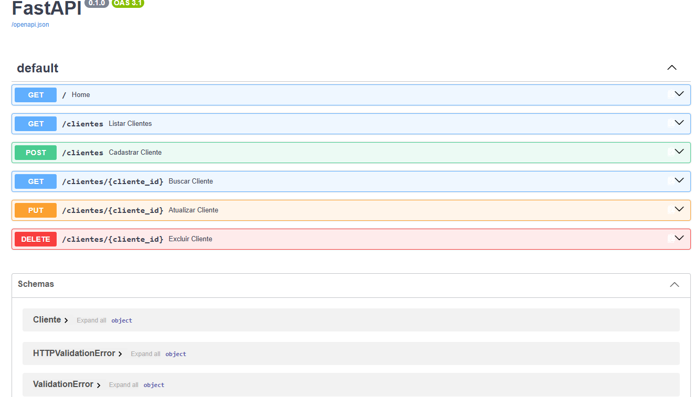

# Customer Management API

A REST API for customer management built with **Python, FastAPI, and MySQL**.

This project demonstrates a complete CRUD system with database integration, data validation, environment variables, error handling, and interactive API documentation.

## API Preview

The API includes interactive Swagger documentation generated automatically by FastAPI.



## Features

- Create customers
- List all customers
- Find customers by ID
- Update customer information
- Delete customers
- MySQL database integration
- Data validation with Pydantic
- Environment variables for database credentials
- Interactive API documentation with Swagger UI
- HTTP 404 handling for customers not found

## Technologies

- Python
- FastAPI
- MySQL
- MySQL Connector/Python
- Pydantic
- Uvicorn
- python-dotenv
- Git
- GitHub

## Project Structure

```text
customer-management-api/
│
├── screenshots/
│   └── swagger-api.png
│
├── app.py
├── requirements.txt
├── README.md
├── .gitignore
└── .env              # Local only - never committed
```

## API Endpoints

| Method | Endpoint | Description |
|---|---|---|
| GET | `/` | Check API status |
| GET | `/clientes` | List all customers |
| GET | `/clientes/{cliente_id}` | Find a customer by ID |
| POST | `/clientes` | Create a new customer |
| PUT | `/clientes/{cliente_id}` | Update a customer |
| DELETE | `/clientes/{cliente_id}` | Delete a customer |

## Example Customer

```json
{
  "nome": "John Doe",
  "email": "john@example.com",
  "idade": 30
}
```

## Example Response

```json
{
  "message": "Cliente cadastrado com sucesso!",
  "id": 1,
  "cliente": {
    "nome": "John Doe",
    "email": "john@example.com",
    "idade": 30
  }
}
```

## Installation

### 1. Clone the repository

```bash
git clone https://github.com/morettichaves/customer-management-api.git
```

Enter the project directory:

```bash
cd customer-management-api
```

### 2. Create a virtual environment

```bash
python -m venv .venv
```

### 3. Activate the virtual environment

Windows PowerShell:

```powershell
.\.venv\Scripts\Activate.ps1
```

### 4. Install dependencies

```bash
pip install -r requirements.txt
```

## Database Configuration

Create the MySQL database:

```sql
CREATE DATABASE customer_management;
```

Select the database:

```sql
USE customer_management;
```

Create the customers table:

```sql
CREATE TABLE clientes (
    id INT AUTO_INCREMENT PRIMARY KEY,
    nome VARCHAR(100) NOT NULL,
    email VARCHAR(150) NOT NULL,
    idade INT NOT NULL
);
```

## Environment Variables

Create a `.env` file in the project root:

```env
DB_HOST=localhost
DB_USER=root
DB_PASSWORD=your_mysql_password
DB_NAME=customer_management
```

The `.env` file contains database credentials and must never be committed to a public repository.

It is already protected by `.gitignore`.

## Running the API

Start the development server:

```bash
uvicorn app:app --reload
```

The API will be available at:

`http://127.0.0.1:8000`

Swagger documentation:

`http://127.0.0.1:8000/docs`

## CRUD Operations

The API implements the four fundamental CRUD operations:

- **Create** → POST
- **Read** → GET
- **Update** → PUT
- **Delete** → DELETE

Customer data is stored persistently in a MySQL database.

## Security

Database credentials are stored using environment variables instead of being hardcoded in the application.

The `.env` file is excluded from version control through `.gitignore`.

## Future Improvements

- Email format validation
- Duplicate email prevention
- Authentication and authorization
- Pagination
- Automated tests
- Docker support
- Cloud deployment

## Author

**Otavio Moretti**

Junior Back-End Developer

GitHub: [morettichaves](https://github.com/morettichaves)